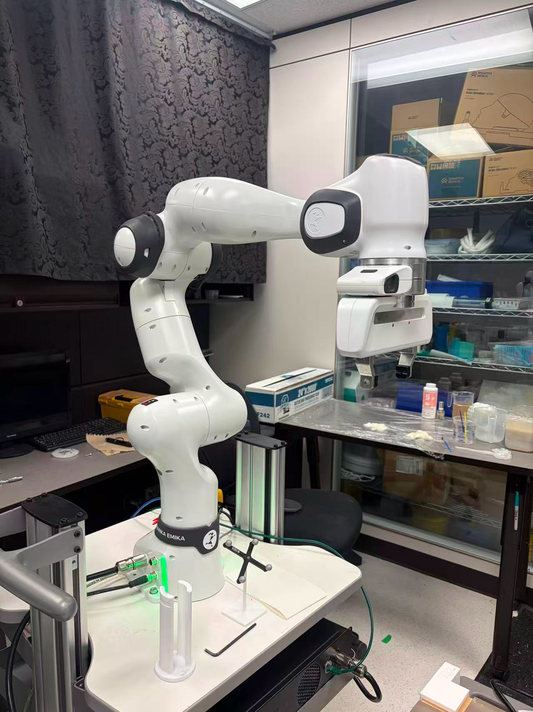
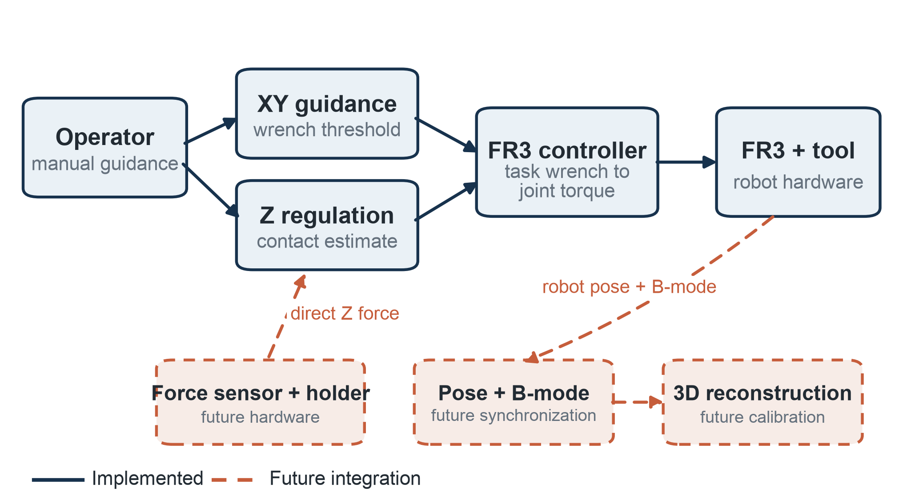
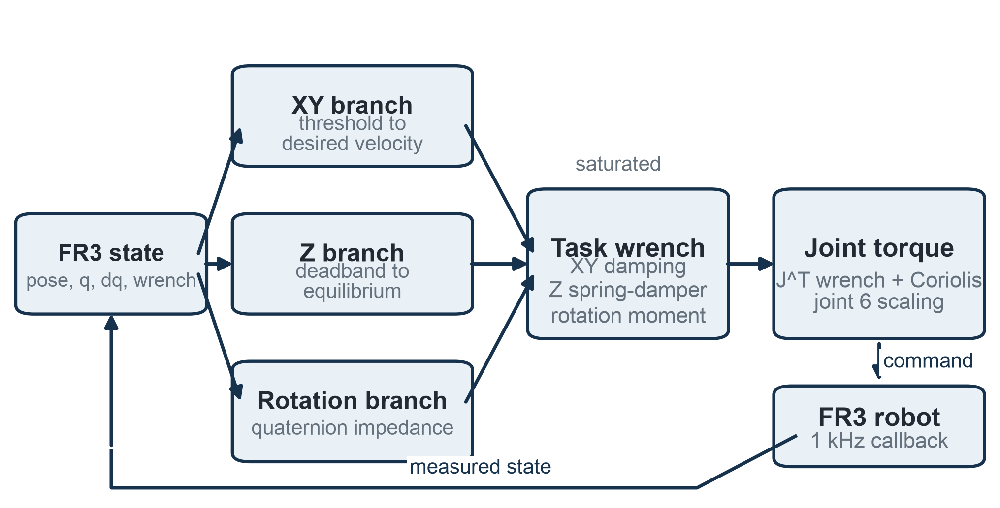
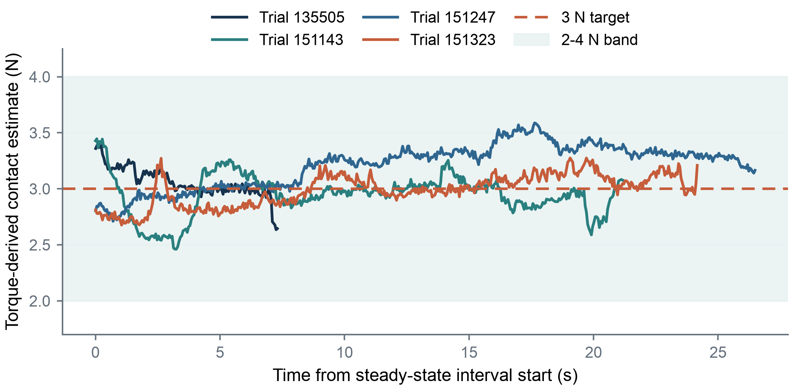
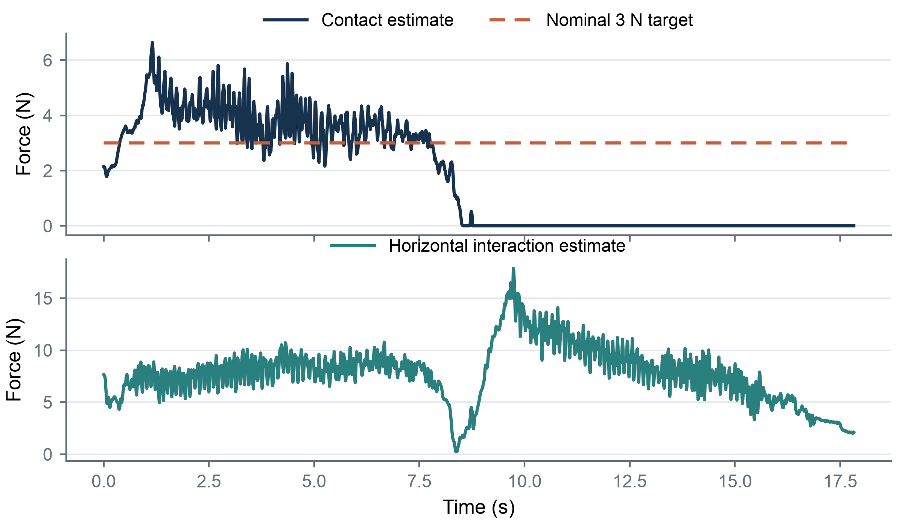

# Human-Assisted Interaction Control for Robotic 3D Ultrasound

An MEng robotics project exploring compliant, hand-guided control of a Franka
Research 3 (FR3) robot as a foundation for future robotic 3D ultrasound
acquisition.



## Project at a Glance

- **Platform:** Franka Research 3, libfranka, Eigen, Ubuntu with a real-time kernel
- **Language:** C++
- **Focus:** Cartesian impedance, physical human-robot interaction, contact-force
  estimation, real-time data logging, and experimental evaluation
- **My contribution:** controller development from initial impedance experiments
  through the final logged implementation, experimental data collection, analysis,
  and technical reporting

The long-term goal is robotic 3D ultrasound, where tracked 2D ultrasound frames
are spatially calibrated and reconstructed into a 3D volume. This project focused
on an earlier control problem: enabling an operator to guide the robot while the
controller attempts to maintain contact with a surface.

## What I Built

The final controller combines three interaction behaviours:

1. **Manual XY guidance:** the robot's estimated external wrench is used to infer
   the operator's intended direction and generate a bounded Cartesian velocity
   reference.
2. **Compliant Z motion with contact regulation:** the operator can still move the
   end effector vertically, while the controller adjusts the Z equilibrium point
   using a torque-derived contact-force estimate.
3. **Low-resistance orientation adjustment:** low rotational stiffness and reduced
   joint-6 task torque make manual tool rotation easier.

The implementation also includes force and task-wrench limits, controlled
Enter-key termination, and timestamped CSV logging at approximately 100 Hz.



## Controller Architecture

The controller runs as a standalone libfranka torque-control example. Robot state
is separated into XY guidance, Z regulation, and rotational impedance branches.
Their task-space outputs are limited, mapped to joint torque through the Jacobian,
and combined with Coriolis compensation.



## Experimental Evaluation

Nineteen trials were collected across five conditions:

| Condition | Trials | Purpose |
|---|---:|---|
| No-contact baseline | 3 | Characterize the torque-derived estimate without contact |
| Stationary soft-surface contact | 7 | Assess regulation near the nominal 3 N target |
| Manual guidance without intended contact | 3 | Examine interaction-force coupling |
| Combined guidance and soft-surface contact | 2 | Test simultaneous guidance and contact |
| Directional guidance | 4 | Compare repeated manual sweeps |

Selected stationary-contact intervals showed that the controller could regulate
its **internal torque-derived estimate** near the target under limited conditions.
This does not establish true contact-force accuracy because no independent force
sensor was available.



Manual guidance exposed the main limitation: the FR3 torque-derived wrench could
not reliably separate operator input, surface contact, configuration effects, and
model error. The same signal was therefore unsuitable as both the interaction
input and an accurate probe-contact measurement.



## Development History

| Version | Main change |
|---|---|
| v1 | Cartesian impedance, force-bias calibration, Z-equilibrium adjustment, slow X scan, and joint-6 locking |
| v2 | Lower stiffness, manual guidance, orientation following, and removal of joint-6 locking |
| v3 | Direction-based XY velocity guidance, Z contact regulation, damping, and task-force limits |
| v4 | Interaction-threshold, force-limit, direction, and Z-response tuning |
| v5 | Faster XY reference, lower rotational resistance, and joint-6 task-torque scaling |
| v5.1 | Buffered logging, timestamped output, and controlled Enter-key termination |

The submitted project files used historical `.c` filenames even though the source
is C++. The extensions are normalized to `.cpp` in this repository; the code itself
is unchanged.

## Repository Structure

```text
.
├── assets/        # Project photographs, system diagrams, and result figures
├── data/          # Nineteen raw CSV experiment logs and a data index
├── report/        # Final MEng technical report
└── src/           # Controller versions v1-v5.1
```

## Build and Run Context

The final controller was developed with Ubuntu 24.04.3 LTS, a
`6.8.1-1035-realtime` kernel, libfranka `0.13.6-1`, and Eigen. It was integrated
into the libfranka examples build so that `examples_common.h` and the project
toolchain were available.

The executable expects the robot hostname:

```bash
./impedance_control_v5_1 <robot-hostname>
```

The log directory in v5.1 is configured as:

```text
/home/vasst/impedance control log
```

This path should be changed for another workstation before building. Operation of
an FR3 requires an appropriately configured robot, real-time control environment,
and adherence to the manufacturer's safety procedures.

## Scope and Limitations

This repository documents a research prototype, not a clinical system. No
ultrasound probe, synchronized B-mode acquisition, spatial calibration, 3D
reconstruction, or independent end-effector force sensor was used in the reported
experiments. The next technical step is to integrate and calibrate an axial force
sensor and probe holder, then compare direct force measurements with the FR3
estimate before attempting ultrasound acquisition.

## Report and Data

- [Final MEng report](report/Yicheng_Gu_MEng_Final_Report.pdf)
- [Final controller](src/impedance_control_v5.1.cpp)
- [Experimental data index](data/README.md)

## Author

**Yicheng Gu**  
MEng project, Western University, 2026  
Supervisor: Prof. Elvis Chen

This repository is provided as an academic portfolio and reproducibility record.
Please contact the author before reusing the code or data.
